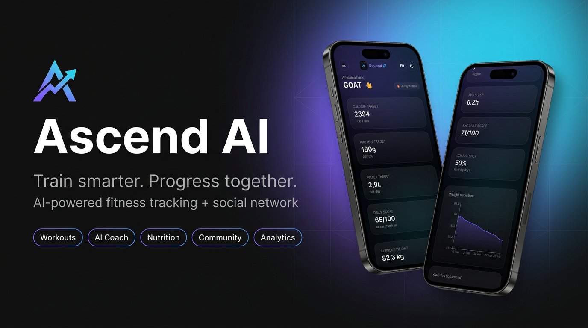
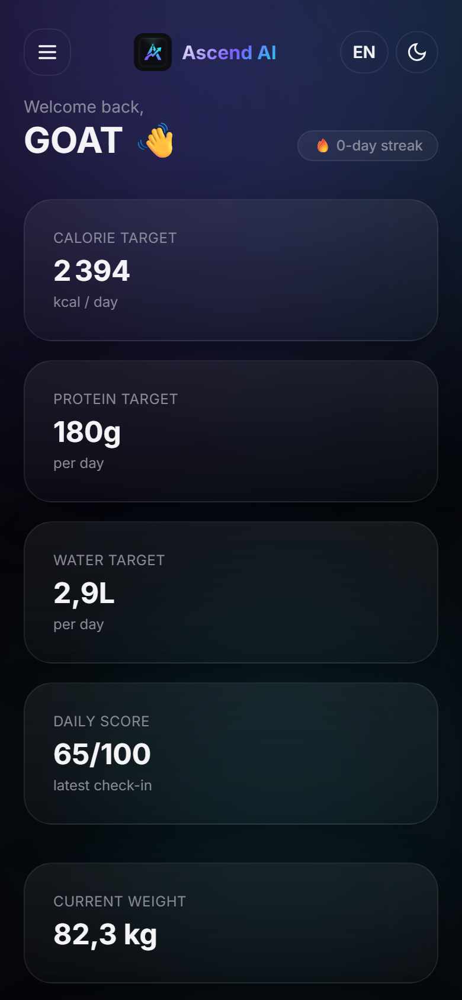
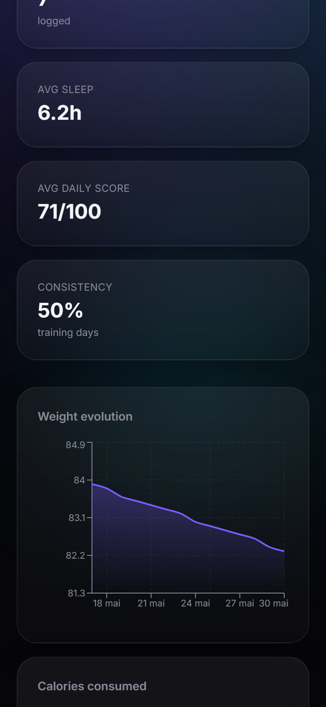
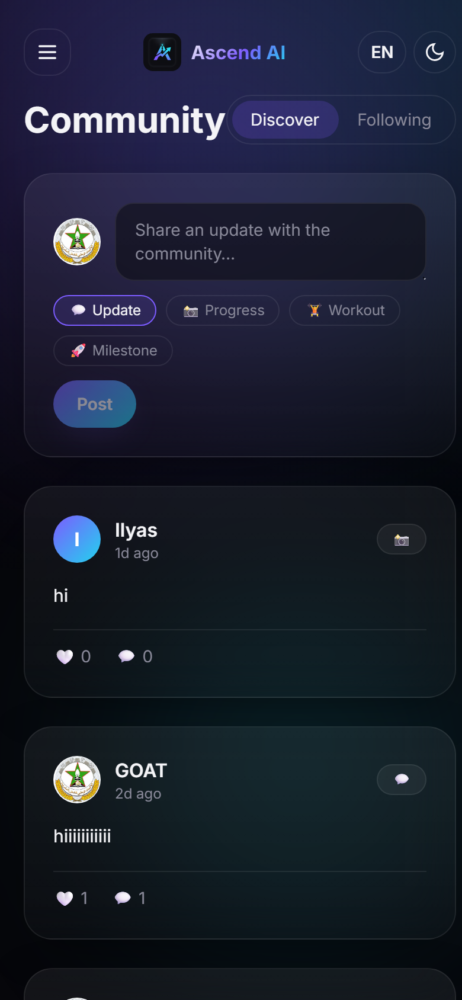
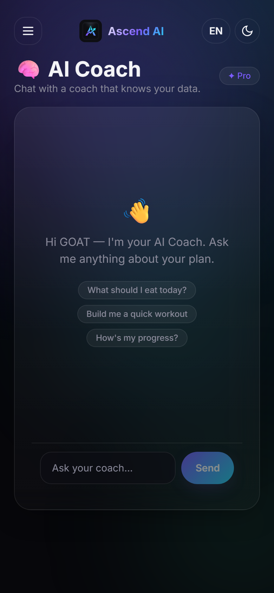

<div align="center">



# Ascend AI

### An AI-powered fitness tracking platform & social network for athletes

[](https://ascend-ai-chi.vercel.app)


</div>

---

**Ascend AI** is a production-grade, full-stack web app that combines a personal fitness
tracker with a complete social network. Users get personalised nutrition and training
targets, log daily check-ins, run guided workouts, chat with a real **AI coach**, and connect
with a community through a feed, direct messages, groups, challenges and leaderboards.

It ships with **three languages** (English / French / Arabic incl. RTL), a **dark/light theme**,
premium motion design, and a complete **free-tier cloud deployment**.

> 🔑 **Try it now:** open the [live demo](https://ascend-ai-chi.vercel.app) and log in with
> `demo@fitjourney.ai` / `demo12345` — or create your own account.
> *(First load may take ~30s while the free backend wakes up.)*

---

## 📸 Screenshots

| Dashboard | Analytics | Community Feed | AI Coach |
| :---: | :---: | :---: | :---: |
|  |  |  |  |

---

## ✨ Features

**Fitness tracking**
- Smart onboarding with a metric engine (BMI, BMR, TDEE, macro/water/sleep targets — Mifflin-St Jeor)
- Daily check-ins with an automatic 0–100 daily score
- Workout library + a live session player that logs every set/rep and saves history
- Nutrition macro tracker with meal logging
- Interactive analytics (weight, calories, sleep, consistency, daily score)
- Gamification: XP, levels, streaks, achievements & badges

**AI Coach**
- A deterministic rules engine for explainable daily recommendations (free)
- A real conversational **LLM chatbot** grounded in your profile & data (premium / admin), powered by **Groq (Llama 3.3 70B)** with a graceful fallback

**Social network**
- Public profiles at `/u/<handle>`
- Feed with posts, likes & comments
- Follow system + instant friends
- Direct messaging with read receipts
- Member-gated **group chats** (join to unlock the conversation)
- Challenges, leaderboards, notifications & an activity feed

**Platform**
- Admin panel: user management with temporary bans & deletion
- i18n: English / French / Arabic with full right-to-left support
- Dark / light theme, Motion One animations, Lenis smooth scroll, a Three.js hero

---

## 🛠️ Tech Stack

**Frontend** — React 19 · TypeScript · Vite · React Router · Zustand · TanStack Query ·
Tailwind CSS · Motion One · Lenis · Three.js · Recharts · react-i18next

**Backend** — Python · Django · Django REST Framework · SimpleJWT · drf-spectacular ·
gunicorn · WhiteNoise · Pillow

**Data / AI / Infra** — PostgreSQL (Neon) · Groq LLM · Cloudinary · Hugging Face Spaces ·
Vercel · GitHub

---

## 🏗️ Architecture

A decoupled client–server design. A React single-page app talks to a stateless Django REST
API over HTTPS using JSON + JWT. The API persists to PostgreSQL, calls Groq for the AI coach,
and stores uploads in Cloudinary.

```
React SPA (Vercel)  ──JWT/JSON──►  Django REST API (Hugging Face)
                                        │
                   ┌────────────────────┼────────────────────┐
                   ▼                    ▼                    ▼
            PostgreSQL (Neon)     Groq LLM API        Cloudinary (media)
```

---

## 🚀 Getting Started (local)

**With Docker (one command):**
```bash
cp .env.example .env
docker compose up --build
# frontend → http://localhost:5173   ·   API docs → http://localhost:8000/api/docs/
```

**Native:**
```bash
# backend
cd backend
python -m venv .venv && .venv/Scripts/activate   # (Unix: source .venv/bin/activate)
pip install -r requirements.txt
python manage.py migrate && python manage.py seed_data && python manage.py runserver

# frontend (new terminal)
cd frontend
npm install && npm run dev
```
The seed creates demo content + a demo account (`demo@fitjourney.ai` / `demo12345`).

---

## ☁️ Deployment

Runs 100% on free tiers — **Vercel** (frontend) + **Hugging Face Spaces** (backend) +
**Neon** (PostgreSQL) + **Cloudinary** (media) + **Groq** (AI). Full step-by-step in
[`docs/DEPLOYMENT.md`](docs/DEPLOYMENT.md).

---

## 👤 Author

**Ilyas Daoud El Asmi** — full-stack developer

[](https://github.com/ilyasdaoudrma)
[](https://www.linkedin.com/in/ilyas-daoud-el-asmi-0a531039b)
[](https://www.instagram.com/ig_yas10/)

---

<div align="center"><sub>Built with Django, React & a lot of coffee ☕</sub></div>
